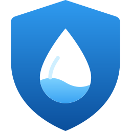

# Abralife (Waterguard+) for Home Assistant

Uoffisiell Home Assistant-integrasjon for **Waterguard+** vannlekkasjesikring via
Abralife-skyen. Installeres med HACS og settes opp med en veiviser: du skriver
bare inn e-post og passord fra Abralife-appen.

> Status: **beta**. Integrasjonen bruker Abras offisielle GraphQL-API
> ([developer.abralife.com](https://developer.abralife.com/)), og alle
> spørringer er validert mot det offisielle skjemaet. Si gjerne fra i Issues om
> hvordan det fungerer med ditt anlegg.

## Hva du får

| Enhet | Entitet i Home Assistant |
|---|---|
| Vannventil | `valve`: status og stenging av vannet (åpning kan slås på, se under) |
| Hjemmet | `binary_sensor` **Vannalarm** (Abras egen alarm) og knappen **Kvitter vannalarm** |
| Linkbox+ | `sensor` **Waterguard-modus** (normal, overstyrt, sabotert …) |
| WaterSensor+ / sensortape | `binary_sensor` for lekkasje, `sensor` for temperatur, luftfuktighet og batteri |
| Alle enheter | tilkobling, lavt batteri og feil (diagnostikk) |

**Sikkerhet:**
- Passordet ditt lagres aldri. Det brukes én gang til å hente en
  innloggingsnøkkel (refresh token) fra Abra. Hvis nøkkelen utløper, ber Home
  Assistant deg logge inn på nytt.
- Å **stenge** vannet er alltid lov. Å **åpne** vannet fra Home Assistant er
  slått av som standard, i tråd med Abras anbefaling om at gjenåpning skal være
  en bevisst handling etter at lekkasjen er utbedret. Du kan slå det på under
  *Innstillinger → Enheter og tjenester → Abralife → Konfigurer*.
- Å **kvittere** en vannalarm åpner aldri vannet. Det er to separate handlinger,
  slik Abra også gjør det.

## Installasjon (HACS)

1. Åpne HACS → ⋮ → **Egendefinerte repositorier**.
2. Lim inn `https://github.com/jrgenl/ha-abralife`, velg type **Integrasjon**, og klikk *Legg til*.
3. Søk opp **Abralife (Waterguard+)** i HACS og klikk *Last ned*.
4. Start Home Assistant på nytt.
5. Gå til **Innstillinger → Enheter og tjenester → Legg til integrasjon** og søk etter **Abralife**.
6. Skriv inn e-post og passord fra Abralife-appen. Har du flere hjem, velger du hvilket.

[](https://my.home-assistant.io/redirect/hacs_repository/?owner=jrgenl&repository=ha-abralife&category=integration)

### Manuell installasjon
Kopier `custom_components/abralife` til `config/custom_components/` og start på nytt.

## Eksempel: steng vannet og varsle ved lekkasje

Waterguard+ stenger selv vannet ved lekkasje. Dette er et ekstra lag, f.eks. for
å varsle hele husstanden:

```yaml
automation:
  - alias: "Vannlekkasje"
    triggers:
      - trigger: state
        entity_id:
          - binary_sensor.hjemme_vannalarm
        to: "on"
    actions:
      - action: valve.close_valve
        target:
          entity_id: valve.hovedkran
      - action: notify.notify
        data:
          title: "💧 Vannlekkasje!"
          message: "Vannalarm fra Waterguard. Vannet er stengt."
```

## For utviklere / feilsøking

- All GraphQL ligger i `custom_components/abralife/queries.py`, basert på
  `schema.graphql` og Abra Connect SDK 0.2.0 fra developer.abralife.com.
  Tilkoblingsverdiene (region, Cognito user pool, client-ID og AppSync-URL) er
  Abras offentlige verdier og ligger i `const.py`.
- `tools/abra_probe.py` logger inn fra egen PC og viser hva integrasjonen ser
  (lagres i `abra_devices.json`).
- Under *Enheter og tjenester → Abralife → ⋮ → Last ned diagnostikk* får du rådata
  fra enhetene (tokens og e-post er fjernet).
- Tester: `pip install pytest-homeassistant-custom-component pycognito && pytest`.

## Lisens

GPL-3.0. Se [LICENSE](LICENSE).

Ikke tilknyttet Abra AS eller Waterguard AS.
